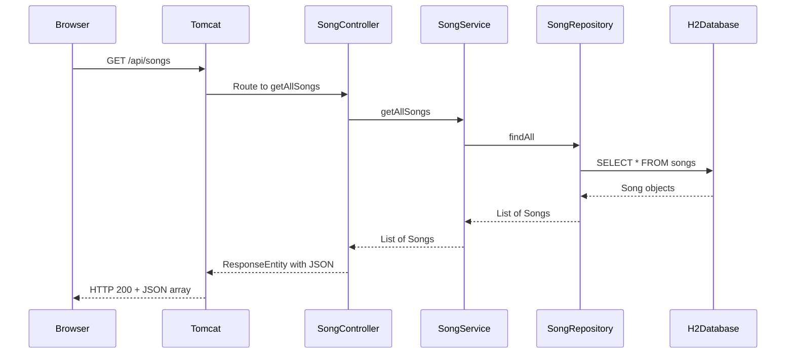

# Spring Boot Application Flow - Complete Explanation

## Table of Contents
1. [Application Startup Flow](#application-startup-flow)
2. [File-by-File Explanation](#file-by-file-explanation)
3. [Request Flow Example](#request-flow-example)
4. [Annotations Explained](#annotations-explained)

---

## Application Startup Flow

When you run `mvn spring-boot:run`, here's exactly what happens:

```mermaid
graph LR
    A["mvn spring-boot:run"] --> B["JVM starts"]
    B --> C["MusicAppApplication.main"]
    C --> D["SpringApplication.run"]
    D --> E["Component Scanning"]
    E --> F["Create Application Context"]
    F --> G["Instantiate Beans"]
    G --> H["DataInitializer runs"]
    H --> I["Embedded Tomcat starts"]
    I --> J["Application Ready on port 8080"]
```



### Step-by-Step Startup:

1. **JVM Launches** → Runs the `main()` method in `MusicAppApplication.java`
2. **Spring Boot Initializes** → `SpringApplication.run()` starts the Spring container
3. **Component Scanning** → Spring scans `com.riff.musicapp` package for annotated classes
4. **Bean Creation** → Spring creates instances of all components:
   - `SongRepository` (interface, JPA creates implementation)
   - `SongService` (service layer)
   - `SongController` (REST endpoints)
   - `DataInitializer` (data loader)
5. **Dependency Injection** → Spring injects dependencies (e.g., `SongRepository` into `SongService`)
6. **DataInitializer Executes** → Automatically runs `run()` method to populate database
7. **Embedded Tomcat Starts** → Web server starts on port 8080
8. **Application Ready** → Listens for HTTP requests

---

## File-by-File Explanation

### 1. [MusicAppApplication.java](file:///Users/gouradhikary/Project/riff-music-app/backend/src/main/java/com/riff/musicapp/MusicAppApplication.java)

**Purpose**: Entry point of the application

```java
@SpringBootApplication
public class MusicAppApplication {
    public static void main(String[] args) {
        SpringApplication.run(MusicAppApplication.class, args);
    }
}
```

**What happens**:
- `main()` is called when JVM starts
- `SpringApplication.run()` bootstraps the entire Spring Boot application
- `@SpringBootApplication` is a meta-annotation that combines:
  - `@Configuration`: Marks this as a configuration class
  - `@EnableAutoConfiguration`: Enables Spring Boot's auto-configuration
  - `@ComponentScan`: Scans for components in `com.riff.musicapp` and sub-packages

**When**: This is the **FIRST** file executed when you start the app

---

### 2. [application.properties](file:///Users/gouradhikary/Project/riff-music-app/backend/src/main/resources/application.properties)

**Purpose**: Configuration file for the application

**What happens**:
- Spring Boot reads this file during startup
- Configures database connection, server port, CORS, etc.
- Values are injected into Spring components

**Key Configurations**:
```properties
server.port=8080                    # Tomcat runs on port 8080
spring.datasource.url=jdbc:h2:mem:riffdb  # In-memory H2 database
spring.jpa.hibernate.ddl-auto=update      # Auto-create tables from entities
```

**When**: Read during Spring Boot initialization (step 2 of startup)

---

### 3. [Song.java](file:///Users/gouradhikary/Project/riff-music-app/backend/src/main/java/com/riff/musicapp/model/Song.java) - Entity Model

**Purpose**: Represents a database table

```java
@Entity
@Table(name = "songs")
@Data
@NoArgsConstructor
@AllArgsConstructor
public class Song {
    @Id
    @GeneratedValue(strategy = GenerationType.IDENTITY)
    private Long id;
    
    @Column(nullable = false)
    private String title;
    // ... other fields
}
```

**What happens**:
- JPA (Hibernate) scans this class during startup
- Creates a `songs` table in the H2 database
- Table columns match the fields in this class

**Annotations Explained**:
- `@Entity`: Tells JPA this is a database entity
- `@Table(name = "songs")`: Table name in database
- `@Id`: Marks primary key field
- `@GeneratedValue`: Auto-increment ID
- `@Column(nullable = false)`: Database constraint
- `@Data`: Lombok generates getters, setters, toString, equals, hashCode
- `@NoArgsConstructor`: Lombok generates no-argument constructor
- `@AllArgsConstructor`: Lombok generates constructor with all fields

**When**: Scanned during component scanning (step 3), table created before DataInitializer runs

---

### 4. [SongRepository.java](file:///Users/gouradhikary/Project/riff-music-app/backend/src/main/java/com/riff/musicapp/repository/SongRepository.java)

**Purpose**: Database access layer (DAO pattern)

```java
@Repository
public interface SongRepository extends JpaRepository<Song, Long> {
}
```

**What happens**:
- Spring Data JPA creates an implementation of this interface automatically
- Provides methods like `findAll()`, `findById()`, `save()`, `deleteById()` without you writing code!
- This is **Spring magic** - you just define the interface, Spring implements it

**Annotations Explained**:
- `@Repository`: Marks this as a data access component (also enables exception translation)

**When**: 
- Interface scanned during component scanning (step 3)
- Implementation created by Spring Data JPA (step 4)
- Used by `SongService` and `DataInitializer`

---

### 5. [DataInitializer.java](file:///Users/gouradhikary/Project/riff-music-app/backend/src/main/java/com/riff/musicapp/config/DataInitializer.java) ⭐

**Purpose**: Populate database with sample data on startup

```java
@Component
public class DataInitializer implements CommandLineRunner {
    
    @Autowired
    private SongRepository songRepository;

    @Override
    public void run(String... args) throws Exception {
        if (songRepository.count() == 0) {
            songRepository.save(new Song(...));
            // ... save more songs
        }
    }
}
```

**What happens** (answering your specific question!):
1. Spring sees `@Component` annotation during component scanning
2. Spring creates an instance of `DataInitializer`
3. Spring sees `@Autowired` and injects `SongRepository` instance
4. Spring sees this class implements `CommandLineRunner`
5. **After all beans are created**, Spring automatically calls the `run()` method
6. The `run()` method checks if database is empty
7. If empty, it saves 5 sample songs using `songRepository.save()`

**Annotations Explained**:
- `@Component`: Tells Spring to create and manage this as a bean
- `@Autowired`: Tells Spring to inject the `SongRepository` dependency
- `CommandLineRunner`: Special interface - Spring calls `run()` after startup

**When**: 
- Bean created during step 4 (bean instantiation)
- `run()` method executed during step 6 (after all beans ready, before Tomcat starts)

> [!IMPORTANT]
> **You never call `DataInitializer` yourself!** Spring Boot automatically:
> 1. Detects it's a `@Component`
> 2. Creates an instance
> 3. Injects dependencies
> 4. Calls `run()` because it implements `CommandLineRunner`

---

### 6. [SongService.java](file:///Users/gouradhikary/Project/riff-music-app/backend/src/main/java/com/riff/musicapp/service/SongService.java)

**Purpose**: Business logic layer (sits between controller and repository)

```java
@Service
public class SongService {
    
    @Autowired
    private SongRepository songRepository;

    public List<Song> getAllSongs() {
        return songRepository.findAll();
    }
    
    public Optional<Song> getSongById(Long id) {
        return songRepository.findById(id);
    }
    // ... other methods
}
```

**What happens**:
- Spring creates this bean during startup
- Injects `SongRepository` via `@Autowired`
- Controller calls these methods to perform operations
- This layer can contain validation, business rules, etc.

**Annotations Explained**:
- `@Service`: Marks this as a service layer component (specialized `@Component`)
- `@Autowired`: Dependency injection of `SongRepository`

**When**: 
- Bean created during step 4
- Methods called when controller receives HTTP requests

---

### 7. [SongController.java](file:///Users/gouradhikary/Project/riff-music-app/backend/src/main/java/com/riff/musicapp/controller/SongController.java)

**Purpose**: REST API endpoints (handles HTTP requests)

```java
@RestController
@RequestMapping("/api/songs")
@CrossOrigin(origins = {"http://localhost:5173", "http://localhost:3000"})
public class SongController {
    
    @Autowired
    private SongService songService;

    @GetMapping
    public ResponseEntity<List<Song>> getAllSongs() {
        List<Song> songs = songService.getAllSongs();
        return ResponseEntity.ok(songs);
    }
    
    @GetMapping("/{id}")
    public ResponseEntity<Song> getSongById(@PathVariable Long id) {
        return songService.getSongById(id)
                .map(ResponseEntity::ok)
                .orElse(ResponseEntity.notFound().build());
    }
    // ... other endpoints
}
```

**What happens**:
- Spring creates this bean during startup
- Registers URL mappings with embedded Tomcat
- When HTTP request arrives, Spring routes it to the correct method
- Method calls service layer, returns response

**Annotations Explained**:
- `@RestController`: Combines `@Controller` + `@ResponseBody` (returns JSON automatically)
- `@RequestMapping("/api/songs")`: Base URL for all methods in this controller
- `@CrossOrigin`: Allows frontend (React) to call this API from different port
- `@GetMapping`: Maps HTTP GET requests to this method
- `@PostMapping`: Maps HTTP POST requests
- `@PathVariable`: Extracts value from URL path (e.g., `/api/songs/5` → id=5)
- `@RequestBody`: Converts JSON in request body to Java object

**When**: 
- Bean created during step 4
- Methods called when HTTP requests arrive (after step 8)

---

## Request Flow Example

Let's trace what happens when frontend calls `GET http://localhost:8080/api/songs`:



### Step-by-Step:

1. **Browser** sends HTTP GET request to `http://localhost:8080/api/songs`
2. **Tomcat** (embedded web server) receives the request
3. **Spring MVC** matches URL to `SongController.getAllSongs()` method
4. **SongController** calls `songService.getAllSongs()`
5. **SongService** calls `songRepository.findAll()`
6. **SongRepository** (JPA implementation) executes SQL: `SELECT * FROM songs`
7. **H2 Database** returns rows
8. **JPA** converts rows to `Song` objects
9. **SongRepository** returns `List<Song>` to service
10. **SongService** returns `List<Song>` to controller
11. **SongController** wraps in `ResponseEntity.ok()`
12. **Spring** converts `List<Song>` to JSON automatically
13. **Tomcat** sends HTTP 200 response with JSON to browser

---

## Annotations Explained

### Spring Core Annotations

| Annotation | Purpose | Example |
|------------|---------|---------|
| `@SpringBootApplication` | Entry point, enables auto-config | Main class |
| `@Component` | Generic Spring-managed bean | DataInitializer |
| `@Service` | Business logic layer | SongService |
| `@Repository` | Data access layer | SongRepository |
| `@RestController` | REST API controller | SongController |
| `@Autowired` | Dependency injection | Inject SongRepository |

### Web Annotations

| Annotation | Purpose | Example |
|------------|---------|---------|
| `@RequestMapping` | Base URL mapping | `/api/songs` |
| `@GetMapping` | Handle HTTP GET | Get all songs |
| `@PostMapping` | Handle HTTP POST | Create song |
| `@PutMapping` | Handle HTTP PUT | Update song |
| `@DeleteMapping` | Handle HTTP DELETE | Delete song |
| `@PathVariable` | Extract from URL | `/songs/{id}` |
| `@RequestBody` | Parse JSON body | Create/Update |
| `@CrossOrigin` | Enable CORS | Allow React frontend |

### JPA/Database Annotations

| Annotation | Purpose | Example |
|------------|---------|---------|
| `@Entity` | Database table | Song class |
| `@Table` | Specify table name | `songs` |
| `@Id` | Primary key | `id` field |
| `@GeneratedValue` | Auto-increment | ID generation |
| `@Column` | Column constraints | `nullable = false` |

### Lombok Annotations

| Annotation | Purpose | Generates |
|------------|---------|-----------|
| `@Data` | All common methods | getters, setters, toString, equals, hashCode |
| `@NoArgsConstructor` | Empty constructor | `Song()` |
| `@AllArgsConstructor` | Full constructor | `Song(id, title, ...)` |

---

## Key Concepts

### 1. Dependency Injection (DI)

Spring automatically creates objects and injects them where needed:

```java
@Service
public class SongService {
    @Autowired  // Spring injects SongRepository instance here
    private SongRepository songRepository;
}
```

**Why?** You don't use `new SongRepository()`. Spring manages object lifecycle.

### 2. Inversion of Control (IoC)

You don't control when objects are created - Spring does:
- You define what you need (`@Autowired`)
- Spring creates and injects it

### 3. Component Scanning

Spring scans `com.riff.musicapp` package for:
- `@Component`, `@Service`, `@Repository`, `@Controller`
- Creates beans automatically

### 4. CommandLineRunner

Special interface for running code after startup:
```java
@Component
public class DataInitializer implements CommandLineRunner {
    @Override
    public void run(String... args) {
        // This runs automatically after Spring starts!
    }
}
```

---

## Summary

**Startup Order**:
1. `MusicAppApplication.main()` → Entry point
2. Spring Boot initialization
3. Component scanning finds all `@Component`, `@Service`, `@Repository`, `@Controller`
4. Spring creates beans (SongRepository, SongService, SongController, DataInitializer)
5. Dependency injection (autowiring)
6. **DataInitializer.run()** executes → Saves songs to database
7. Tomcat starts on port 8080
8. Application ready for requests

**Request Flow**:
Browser → Tomcat → Controller → Service → Repository → Database → back

**Key Takeaway**: 
> Spring Boot does a lot of "magic" through annotations. You declare what you want (`@Component`, `@Autowired`), and Spring figures out how to wire everything together!
